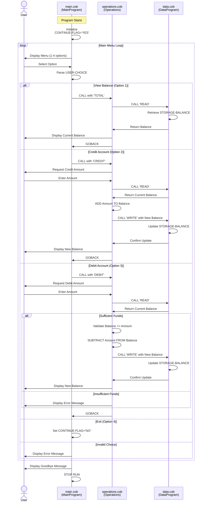
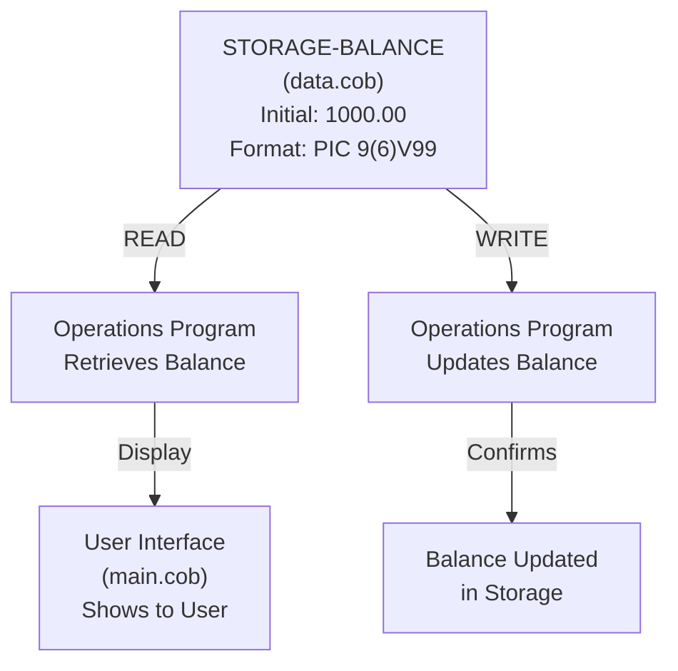
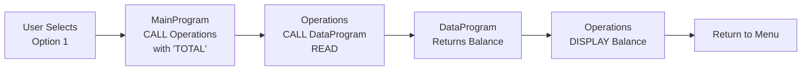
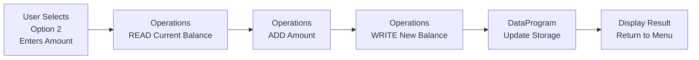
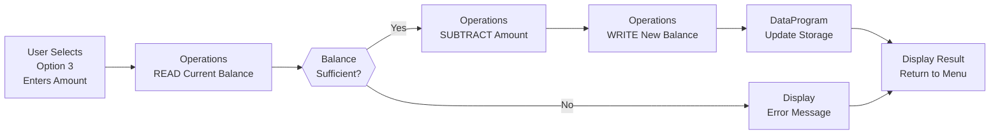

# Student Account Management System - COBOL Implementation

## Overview
This documentation describes the structure and functionality of the Student Account Management System, a COBOL-based application designed to manage student bank accounts and financial transactions.

---

## COBOL File Structure

### 1. **main.cob** - Main Program Entry Point
**Purpose:** Serves as the primary user interface and menu-driven entry point for the application.

**Key Functions:**
- Displays an interactive menu with four options:
  1. View Balance
  2. Credit Account
  3. Debit Account
  4. Exit
- Routes user selections to appropriate operations
- Maintains program loop until user exits
- Validates user input (accepts choices 1-4)

**Variables:**
- `USER-CHOICE`: Stores the menu selection (numeric, 0-9)
- `CONTINUE-FLAG`: Controls the main loop (YES/NO)

**Program Flow:**
```
Display Menu → Accept User Input → Evaluate Choice → 
Call Operations Program → Loop Until Exit
```

---

### 2. **data.cob** - Data Storage and Retrieval Module
**Purpose:** Acts as the persistent data layer for account balance storage and retrieval.

**Key Functions:**
- `READ` Operation: Retrieves the current account balance from storage
- `WRITE` Operation: Updates the account balance in storage

**Variables:**
- `STORAGE-BALANCE`: Maintains the account balance in persistent memory (initialized at 1000.00)
- `OPERATION-TYPE`: Determines whether to read or write data
- `BALANCE`: Linkage section variable for passing data to/from calling programs

**Business Rules:**
- Initial account balance is **1000.00**
- Balance is stored with precision of two decimal places (currency format)
- Data is passed via linkage section for inter-program communication

---

### 3. **operations.cob** - Business Logic and Transaction Processing
**Purpose:** Contains the core business logic for all account operations (balance inquiry, credits, and debits).

**Key Functions:**

#### a) **TOTAL** - View Current Balance
- Calls DataProgram to read current balance
- Displays balance to the user
- No modifications to account state

#### b) **CREDIT** - Add Funds to Account
- Prompts user to enter credit amount
- Retrieves current balance from DataProgram
- Adds the credit amount to balance
- Writes updated balance back to DataProgram
- Displays the new balance to user

#### c) **DEBIT** - Withdraw Funds from Account
- Prompts user to enter debit amount
- Retrieves current balance from DataProgram
- **Validates sufficient funds** before processing debit
- If funds available: Subtracts amount and updates balance
- If insufficient funds: Rejects transaction with error message
- Displays updated balance (or error if transaction failed)

**Variables:**
- `OPERATION-TYPE`: Identifies which operation to perform (TOTAL, CREDIT, DEBIT)
- `AMOUNT`: Stores transaction amount entered by user
- `FINAL-BALANCE`: Holds current account balance during operations

---

## Business Rules for Student Accounts

1. **Initial Account Balance**
   - All student accounts start with a balance of **1000.00**

2. **Debit Restrictions**
   - Debits (withdrawals) are only allowed if the account has **sufficient funds**
   - A debit request that exceeds the current balance is automatically rejected
   - Error message: "Insufficient funds for this debit."
   - Balance remains unchanged on failed debit attempts

3. **Credit Operations**
   - Credits (deposits) are always allowed
   - Any positive amount can be credited to the account

4. **Balance Precision**
   - All amounts are handled with two decimal places (currency standard)
   - Format: `PIC 9(6)V99` (up to 999999.99)

5. **Transaction Logging**
   - Currently, the system displays transaction results to the user
   - Transaction amounts and new balances are shown after each operation

6. **Data Persistence**
   - Account balance is stored in the DataProgram module
   - Balance persists across multiple transactions within a program session
   - Balance resets to 1000.00 on program restart (no permanent storage)

---

## System Architecture

```
┌──────────────────┐
│   main.cob       │  (User Interface & Menu)
│  - Displays Menu │
│  - Routes Calls  │
└────────┬─────────┘
         │
         ├─────────────────────┬──────────────────┐
         │                     │                  │
    ┌────▼────────┐   ┌────────▼──┐   ┌─────────▼──┐
    │operations   │   │operations │   │operations  │
    │TOTAL        │   │CREDIT     │   │DEBIT       │
    └────┬────────┘   └────────┬──┘   └─────────┬──┘
         │                     │                │
         └─────────────────────┼────────────────┘
                               │
                        ┌──────▼──────────┐
                        │   data.cob      │
                        │  Persistent     │
                        │  Balance Storage│
                        └─────────────────┘
```

---

## Running the Application

1. The program starts by displaying the main menu (from `main.cob`)
2. User selects an option (1-4)
3. For options 1-3, the system calls the `Operations` program with the appropriate operation code
4. Operations program interacts with the `DataProgram` to read/write balance as needed
5. Results are displayed to the user
6. Loop returns to menu until user selects option 4 (Exit)

---

## Error Handling

- **Invalid Menu Choice**: Displays "Invalid choice, please select 1-4." and returns to menu
- **Insufficient Funds**: Debit operation fails with message "Insufficient funds for this debit."
- **Invalid Input Outside Range**: Input validation limited to menu choices; amount inputs accept any positive numeric value

---

## Data Flow Sequence Diagrams

### Full Application Workflow



### Data Storage Structure



### Transaction Flow Examples

#### View Balance Transaction


#### Credit Transaction


#### Debit Transaction (with Validation)

